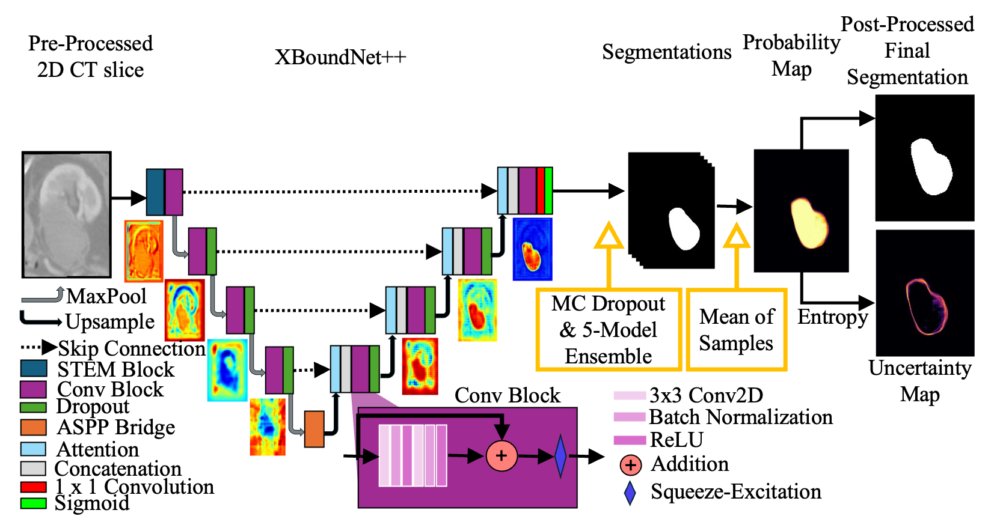

# XBoundNet++: Uncertainty-Aware Segmentation of the Ambiguously-Labeled Kidney Ablation Zone 


This repository contains the official implementation of the paper:


> **XBoundNet++: Uncertainty-Aware Segmentation of the Ambiguously-Labeled Kidney Ablation Zone** <br>
> Oren Arbel-Wood, Aaron Fenster, Maryam Rastegarpoor<br>
> Accepted to the 2nd MICCAI Student Board (MSB) EMERGE Workshop held in conjunction with the 28th International Conference on Medical Image Computing Computer Aided Intervention (MICCAI) 2025<br>
> **Paper** [openreview](https://openreview.net/pdf?id=lHgWi8hprO)

## Overview

In this work, we introduce XBoundNet++, a clinically novel deep learning framework designed specifically for a problem that is often overlooked in medical AI: How to accurately delineate a region in ambiguous or roughly labeled scans - in this case, post-treatment analysis for renal cell carcinoma (kidney cancer). 

Why is this needed? In many real-world clinical settings, ground truth labels are rough approximations, and boundaries are inherently unclear due to poor imaging contrast or subjective interpretations. Traditional segmentation models break down in these contexts - the very situations where clinical AI is most urgently needed.

XBoundNet++ tackles this challenge head-on by providing:
- Boundary-aware segmentation optimized for uncertain labels.
- Layer-wise interpretability via Grad-CAM, enabling clinicians to visualize how the model arrived at a prediction.
- Bayesian uncertainty estimation and probability maps using Monte Carlo dropout and model ensembling. 

The model excels at segmentation while offering spatial uncertainty and probability overlays. These features support more informed clinical review and promote safer, more trustworthy AI-assisted decision-making in interventional radiology - ultimately leading to improved patient outcomes. 

This work was done at the incredible lab at Robarts Research Institute, and was made possible through the guidance of my supervisors - Aaron Fenster and Maryam Rastegarpoor. 

<div align="center">

&nbsp; 

</div>


## 1. Instructions

### 1.1 Installation
It is recommended to use a virtual environment (e.g., venv) to avoid package conflicts. Here we assume you are using venv as your virtual environment. If you are using conda, please adjust the commands accordingly.

```bash
git clone https://github.com/oarbelw/XBoundNetPlusPlus.git
cd XBoundNetPlusPlus
pip install -r requirements.txt
```

### 1.2 Running the Jupyter Notebook
The following will open a Jupyter Notebook environment, please open and run `XBoundNet.ipynb`
```bash
jupyter notebook
```

