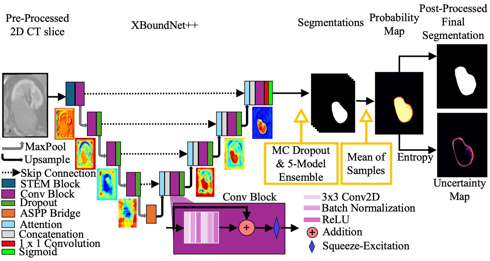

# XBoundNet++: Uncertainty-Aware Segmentation of the Ambiguously-Labeled Kidney Ablation Zone 

This repository contains the official implementation of the paper:

> **XBoundNet++: Uncertainty-Aware Segmentation of the Ambiguously-Labeled Kidney Ablation Zone** 
> Oren Arbel-Wood, Aaron Fenster, Maryam Rastegarpoor
> Accepted to the 2nd MICCAI Student Board (MSB) EMERGE Workshop held in conjunction with the 28th International Conference on Medical Image Computing Computer Aided Intervention (MICCAI) 2025
> Paper [openreview](https://openreview.net/pdf?id=lHgWi8hprO)

&nbsp; 

